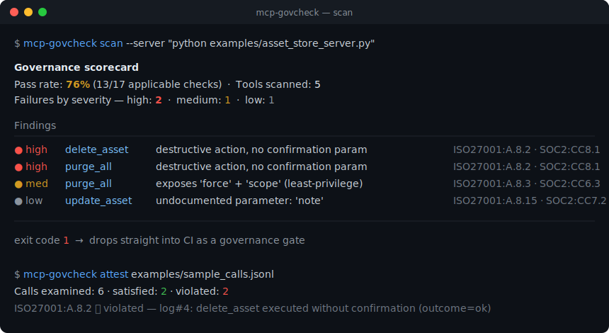

# mcp-govcheck

[](https://github.com/Universe8888/mcp-govcheck/actions/workflows/ci.yml)
[](https://www.python.org/)
[](./LICENSE)

**Design-time governance scorecard and control-mapped compliance evidence for MCP servers.**

`mcp-govcheck` answers a question every team shipping an AI agent eventually faces:
*"Can I prove this agent's tools are governed?"* It introspects an MCP server's **tool
design**, scores it against a labeled governance rubric, and turns a **tool-call log** into
**audit-ready evidence mapped to ISO 27001 / SOC 2 controls**.

It is the **auditor's view of an agent's capabilities** — not another gateway.

```bash
# Score a running MCP server's tool design
mcp-govcheck scan --server "python examples/asset_store_server.py"

# Turn a tool-call log into control-mapped compliance evidence
mcp-govcheck attest examples/sample_calls.jsonl
```



> Real output from the bundled demo server (`examples/asset_store_server.py`). An animated version
> can be regenerated with [`vhs assets/demo.tape`](./assets/demo.tape).

---

## What it is — and what it is NOT

The MCP infrastructure space is crowded with **runtime gateways, proxies, and firewalls**
(Kong, casdoor, lunar.dev, pipelock, …) and with **model-behavior graders** (iFixAi, …).
`mcp-govcheck` deliberately occupies neither lane:

| | Runtime gateways / firewalls | Model-behavior graders | **mcp-govcheck** |
|---|---|---|---|
| Sits in the request path? | Yes (proxy) | No | **No** |
| What it evaluates | Live traffic | The model's outputs | **The tool *design* + the tool-call *record*** |
| When | Runtime | Runtime / eval | **Design time / audit time** |
| Output | Allow/deny, receipts | A safety grade | **Governance scorecard + control-mapped evidence** |

It is **static and offline**: it never executes your tools and never sits between your agent
and its tools. Think of it as a linter + evidence generator for agent governance, the way an
ISO 27001 / SOC 2 auditor would look at the capability surface.

## Why

As agents move from demo to production, the hard question shifts from *"does it work?"* to
*"can we prove it's controlled?"* — least privilege, human-in-the-loop on destructive actions,
auditability. Those are governance controls, and they apply to an agent's tool surface exactly
as they apply to any other privileged system. `mcp-govcheck` makes that surface auditable.

## Install

```bash
pip install -e .          # from a clone (PyPI publish deferred; see Roadmap)
```

Requires Python 3.11+. Depends on the official `mcp` SDK and `pyyaml`.

## Usage

### `scan` — score a tool surface

```bash
# Introspect a live stdio MCP server
mcp-govcheck scan --server "python my_server.py"

# Or score a static tool-schema JSON (an MCP tools/list result, or a list of descriptors)
mcp-govcheck scan tools.json

mcp-govcheck scan tools.json --json --out scorecard.json   # machine-readable
mcp-govcheck scan tools.json --rubric my-rubric.yaml       # custom rubric
```

`scan` exits **0** when clean, **1** when any check fails, **2** on bad input — so it drops
straight into CI as a governance gate.

### `attest` — generate compliance evidence

```bash
mcp-govcheck attest calls.jsonl            # markdown evidence pack
mcp-govcheck attest calls.jsonl --json     # machine-readable
```

The log is JSONL, one call per line:

```json
{"ts": "2026-06-17T10:02:00", "tool": "delete_asset", "args": {"id": 2}, "confirmed": true, "outcome": "ok"}
```

`attest` maps the log to controls and reports each as **satisfied / violated / no-evidence**,
citing the exact log lines. Exit **1** if any control is violated.

## The default rubric

Checks ship in [`rubrics/default.yaml`](./rubrics/default.yaml), each mapped to controls in the
canonical catalog ([`controls.py`](./src/mcp_govcheck/controls.py)):

| Check | Principle | Controls |
|---|---|---|
| `destructive-requires-confirmation` | Human-in-the-loop on `delete_*` actions | ISO27001:A.8.2 · SOC2:CC8.1 |
| `purge-requires-confirmation` | Human-in-the-loop on `purge_*` actions | ISO27001:A.8.2 · SOC2:CC8.1 |
| `no-force-escape-hatch` | Least privilege (no `force` / `skip_*` / `no_confirm` / `scope`) | ISO27001:A.8.3 · SOC2:CC6.3 |
| `tool-has-description` | Auditability — tools documented | ISO27001:A.8.15 |
| `parameters-documented` | Auditability — parameters documented | ISO27001:A.8.15 · SOC2:CC7.2 |

Rubrics are declarative YAML; control references are validated on load (an unknown control id
or rule name fails loudly rather than silently skipping a check).

## Benchmarks

`mcp-govcheck` is evaluated, not asserted. Every run of `python evals/run_evals.py` reports
labeled **scan accuracy** and adversarial **safety properties**, and appends a timestamped
block to [`BENCHMARK.md`](./BENCHMARK.md) (runs are never overwritten, so regressions stay
visible). Current run:

- **Scan accuracy:** 13/13 = 100% on labeled scenarios (the rubric is deterministic, so this
  is a correctness check on the labels + engine, not a probabilistic score).
- **Safety properties:** 5/5 held — e.g. a destructive tool with no confirmation is *always*
  flagged; `attest` *never* reports a control satisfied when the log contains a violating call.

The safety properties are the hard CI gate; an accuracy mismatch is reported but treated as a
"labels/rubric drifted" warning.

## Try it on the demo

[`examples/asset_store_server.py`](./examples/asset_store_server.py) is a runnable MCP server
with deliberately mixed governance: `get_asset` / `retire_asset` are clean, while
`delete_asset` (no confirmation), `purge_all` (force + wildcard scope), and `update_asset`
(an undocumented parameter) each trip a different check.

```bash
mcp-govcheck scan --server "python examples/asset_store_server.py"
mcp-govcheck attest examples/sample_calls.jsonl
```

## Roadmap

v1 is intentionally lean. Deferred: runtime/streaming mode, a web dashboard, more control
frameworks (NIST AI RMF, EU AI Act), auto-remediation suggestions, multi-server aggregation,
and a PyPI release. See [ARCHITECTURE.md](./ARCHITECTURE.md) for the design.

## License

MIT — see [LICENSE](./LICENSE).
